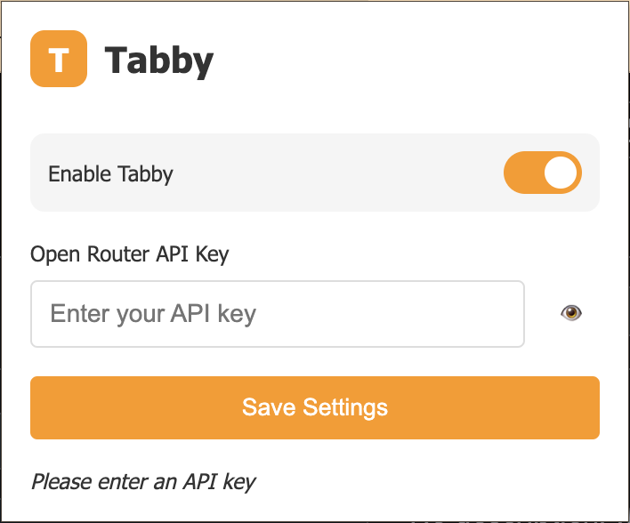

# Tabby - AI-Powered Autocomplete Extension



Tabby is a Chrome extension that enhances your typing experience with **AI-powered autocomplete suggestions**. It predicts your next words using language models through OpenRouter's API, making typing faster and more efficient.

## ✨ Features

- **Smart Context Awareness**: Provides relevant suggestions based on your typing context.
- **Ghost Text Previews**: Displays suggestions as faint text that disappears as you continue typing.
- **One-Tab Acceptance**: Press `Tab` to instantly accept suggestions.
- **Privacy**: Processes data locally using chrome storage.

## 🚀 Installation

### Prerequsites

1. Chromimum based broswer (Ex. Google Chrome, Brave, Arc, ...)

### Step 1: Clone the Repository

```bash
git clone https://github.com/Adhijaan/Tabby
cd Tabby
```

### Step 2: Load the Extension

1. Open your browser and go to extenstions ex. `chrome://extensions`.
2. Enable **Developer Mode** (toggle in the top-right corner).
3. Click **Load Unpacked** and select the `Tabby` directory.

### Step 3: Configure the API Key

1. Get an API key from [OpenRouter](https://openrouter.ai).
2. Click the Tabby extension icon to open **Options**.
3. Enter your API key and click **Save**.

## 🖱️ Usage

1. Focus on any text input fields or textarea.
2. Start typing – suggestions will appear as ghost text.
3. Press `Tab` to accept the suggestion.
4. Continue typing to ignore the suggestion.

## 🛠️ Technical Highlights

### Core Technologies

- **Chrome Extension APIs** (Manifest V3, Service Workers, Content Scripts)
- **OpenRouter API Integration** (AI completions)
- **Modern JavaScript** (ES6+, Async/Await)
- **DOM Manipulation** (Dynamic element positioning and scrolling)
- **Debounced API Calls** (Optimized performance)
- **API Key Managment** (Through `chrome.storage`)

### Key Components

- **Content Script** (content.js): Detects textareas, handles user input, overlays ghost text suggestions.
- **Service Worker** (background.js): Manages API communication and message passing.
- **Options Page** (hello.html + options.js): Allows users to configure API keys and settings.

## 📚 Development Journey

### Challenges Faced

- **Alignment** - I struggled getting the ghost text overlay to align with the text element.
- **Documenation** - I skipped reading chrome documentation initally relying on LLMs to give me information as needed. I learned this is not an effective approach and it is worth first breaking down what I might need for a project and then reading the relevant documentaion

### Future Improvements

- **Mid text suggestions** - I'd like to allow suggestions while the use is in the middle of their text instead of only at the end.
- **LLM Model Selection** - I want to allow a user to choose different models in case they hit rate limits or want a specific model for a task

## License

This code repository is licensed under the MIT License.
